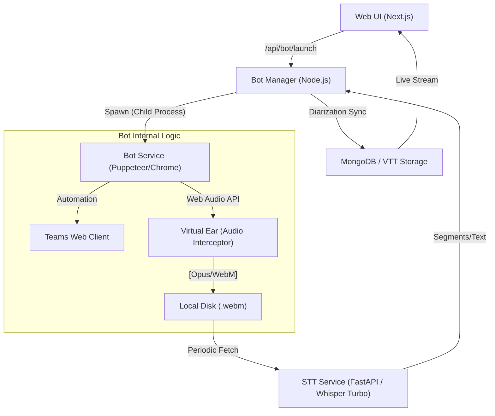

# MeetingAI: Technical Architecture Overview

The MeetingAI bot is a multi-layered system designed to reliably join Microsoft Teams meetings, intercept participant audio streams, and generate real-time, high-accuracy transcripts with speaker diarization.

## System Architecture Diagram

---

## Core Components

### 1. Browser Automation (Puppeteer)
The bot operates using a headless Chrome instance controlled by Puppeteer. 
- **Flags**: Uses specialized flags (`--use-fake-ui-for-media-stream`, `--disable-webrtc-hw-encoding`) to ensure WebRTC stability in headless, non-GPU environments.
- **Join Logic**: Implements a multi-stage "Modal Buster" that identifies and clicks landing page buttons ("Continue on this browser"), entry screen toggles (Mic/Cam OFF), and post-join confirmation shims.

### 2. The "Virtual Ear" (Audio Interceptor)
Unlike traditional bots that rely on external recording servers, MeetingAI uses a **browser-native interception** strategy.
- **Recursive Iframe Probing**: Scans the Teams DOM recursively to find `<audio>` and `<video>` tags hidden inside nested iframes.
- **Web Audio Implementation**:
    - **Source**: Taps into `el.srcObject` or `el.captureStream()`.
    - **Analyser**: Provides real-time RMS Volume Activity logs (`Volume Activity > 0` = Genuineness Proof).
    - **Destination**: Re-routes all participant streams into a single `MediaStreamDestination`.
- **Encoding**: Uses `MediaRecorder` with `audio/webm;codecs=opus` for high-quality, low-bandwidth capture.

### 3. STT Engine (Whisper v3-Turbo)
The transcription is handled by a local FastAPI server running **faster-whisper**.
- **Model**: `v3-turbo` (Upgraded from `base` for technical accuracy).
- **Beam Search**: `beam_size=5` for optimal word selection.
- **VAD Filter**: Voice Activity Detection (VAD) is enabled to skip silences and background noise.
- **Initial Prompt**: Seeds the model with "Microsoft Teams meeting" context to improve entity recognition (names, terms).

### 4. Diarization (The "Stitching" Logic)
MeetingAI achieves speaker identification without expensive server-side diarization by observing the **Teams UI**.
- **Speaker Observer**: Polling the DOM every 500ms for indicators like `[aria-label*="is speaking" i]` or `.is-speaking`.
- **Sync Timeline**: 
  - Audio segments are recorded with a `wall_clock` timestamp.
  - UI-based speaker events are logged with the same `wall_clock`.
  - The Manager stitches them together: "Who was speaking on the UI when this 5-second audio chunk was created?"

---

## Data Flow (End-to-End)
1. **Trigger**: User clicks "Launch Bot".
2. **Join**: Bot enters meeting, mutes itself, and kills all popups.
3. **Capture**: "Virtual Ear" begins streaming Opus-encoded chunks to disk every 2 seconds.
4. **Processing**: Every 20KB (~8-10s), the Bot triggers a local STT request.
5. **Diarization**: STT segments are merged with the current speaker detected in the UI.
6. **VTT Generation**: Manager converts results into standard WebVTT format for browser playback.
